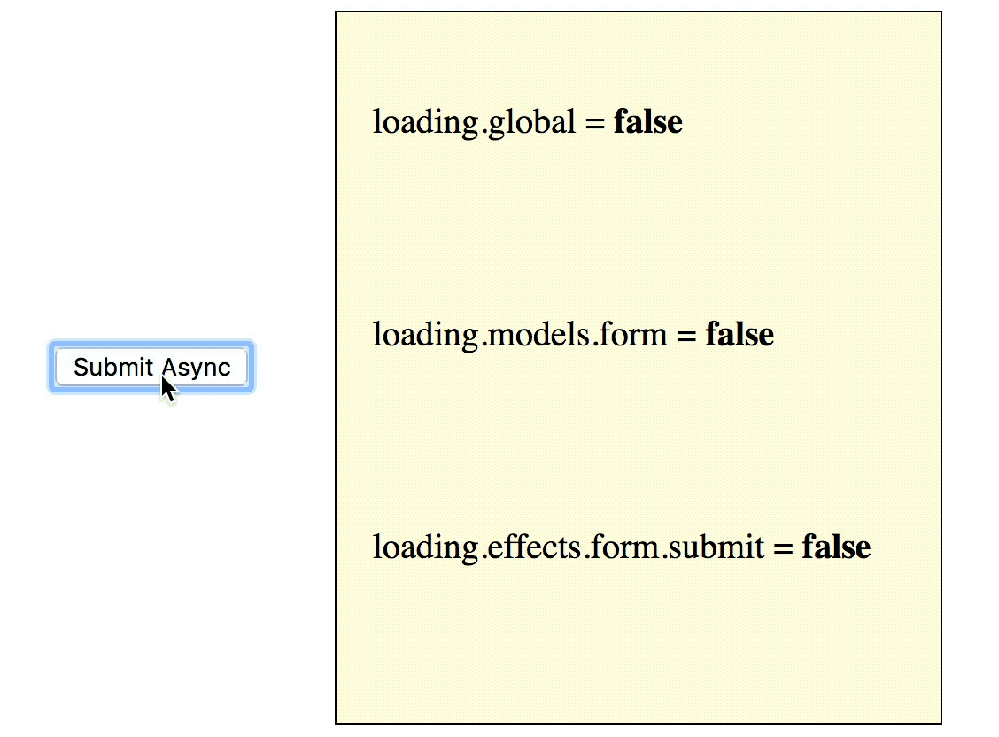

# Rematch Loading

添加自动 loading 指示器 effects 到 [Rematch ](https://github.com/rematch/rematch)。灵感来自于 [dva-loading](https://github.com/dvajs/dva-loading)。

### 安装

```bash
npm install @rematch/loading
```

> 对于 @rematch/core@0.x 使用 @rematch/loading@0.5.0

### 示例

请参见下面的示例，使用一个按钮中的 loading 指示器。

```javascript
import React from 'react'
import { connect } from 'react-redux'
import AwesomeLoadingButton from './components/KindaCoolLoadingButton'

const LoginButton = (props) => (
  <AwesomeLoadingButton onClick={props.submit} loading={props.loading}>
    Login
  </AwesomeLoadingButton>
)

const mapState = (state) => ({
  loading: state.loading.effects.login.submit, // true when the `login/submit` effect is running
  // or
  loading: state.loading.models.login, // true when ANY effect on the `login` model is running
})

const mapDispatch = (dispatch) => ({
  submit: () => dispatch.login.submit()
})

export default connect(mapState, mapDispatch)(LoginButton)
```

### Demo

查看一个 [demo](https://github.com/rematch/rematch/tree/master/plugins/loading/examples/react-loading-example)



### 设置

配置 loading。

```javascript
import { init } from '@rematch/core'
import createLoadingPlugin from '@rematch/loading'

// see options API below
const options = {}

const loading = createLoadingPlugin(options)

init({
  plugins: [loading]
})
```

### Options

#### asNumber

```javascript
{ asNumber: true }
```

该 loading state 值 是一个“counter”，返回一个数字（例：`store.getState().loading.global === 5`）

缺省值是`false，`返回一个布尔值（例：`store.getState().loading.global === true`）

#### name

```javascript
{ name: 'load' }
```

在这种情况下，可以从`state.load.global`访问 loading 。

默认名称是`loading`（例：`state.loading.global`）

#### whitelist

一个 action 列表。命名使用“model名称” / “action名称”

```javascript
{ whitelist: ['count/addOne'] })
```

#### blacklist

一个 action 列表，不使用 loading  指示器。

```javascript
{ blacklist: ['count/addOne'] })
```

#### model

`{ model: {...} }`

包含在 loading model 中的 [model ](https://github.com/rematch/rematch/blob/master/docs/api.md#model)配置对象。 用户可以添加自定义的`name`，`reducer`和`state`配置以及`selectors`和其他插件提供的其他有效配置。

这个配置的一个优点是它提供了利用 [@rematch/select](https://github.com/rematch/rematch/blob/master/plugins/select/README.md) 插件的优势，并且添加自定义的`selectors`到你的loading model。例如：

```javascript
import createLoadingPlugin from '@rematch/loading'

// @rematch/selector plugin API
const options = {
  model: {
    selectors: {
      loggingIn(state) { return state.effects.login.submit }
    }
  }
}

const loading = createLoadingPlugin(options)
```

关于模型配置选项的一些注意事项：

* 
